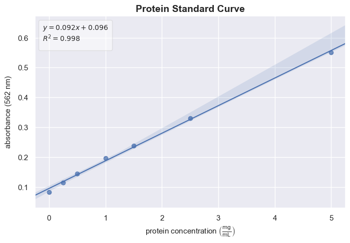
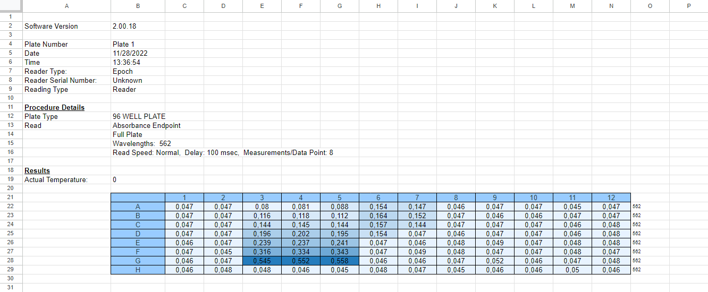

# BCA Protein Assay Analysis

For this project I wanted to create a Python script to analyze data from a BCA Protein Assay reading, a test molecular biologists use to measure protein concentrations in lab samples. The script reads data from an Excel file, plots a linear regression curve for the data, and calculates protein levels based on a few inputs from the user.

The provided Python script processes data from an Excel file, generates a standard curve (a visual representation of the relationship between protein concentration and absorbance), and calculates protein concentrations in your samples.

**Note:** The script has been made to function specifically on absorbance readings generated by a BioTek Epoch™ 2 96 WELL PLATE Microplate UV/VIS reader.

## What is a BCA Assay?

A BCA (Bicinchoninic Acid) assay is a commonly used laboratory test in the field of molecular biology to determine the amount of protein in a sample. It works by measuring how much light is absorbed (absorbance value at a specific wavelength) by the proteins in the sample when a specific reagent is added. This light absorption is then used to calculate the concentration of protein. You can think of it like using a colorimeter to measure how dark a color is, which can tell you how much of a particular substance is present in your sample. This is a standard test when working with a variety of laboratory samples, and one which is used frequently when extracting protein from cells or tissue samples.




*Figure: A standard curve output from the script.*

## Project Files

Here's a quick overview of the files included in this repository:

- **`standard_curve.png`**: The plot of the protein standard curve generated by the script.
- **`bca_assay_analysis.py`**: The Python script used for analyzing the absorbance data.
- **`bca_assay.xlsx`**: An example Excel file containing absorbance readings from the 96-well plate.
- **`bca_assay_analysis.ipynb`**: The Jupyter Notebook file containing the script and additional notes.
- **`example_xlsx.png`**: An image showing what the Excel file looks like.

## How to Use the Script

### 1. Prerequisites

To run the script, you'll need:

- Python 3 installed on your computer. If you don't have it, you can download it from https://www.python.org/.
- The necessary Python packages installed. You can install them using pip (or like me, you might already have them installed). Open your command prompt or terminal and run:

  ```bash
  pip install pandas matplotlib seaborn numpy scikit-learn
  ```

### 2. Preparing Your Data

Make sure you have an Excel file similar to `bca_assay.xlsx`, which contains the absorbance readings from your 96-well plate. The file should have columns with absorbance data and a few rows at the bottom to be selected by the script.

The Excel file should look like this:



*Figure: Example of the BCA Assay Excel file format*

### 3. Running the Script

1. **Open Command Prompt or Terminal**: 

   - On Windows, you can search for "cmd" or "Command Prompt".
   - On macOS or Linux, you can open the Terminal application.

2. **Navigate to the Project Directory**: 

   Use the `cd` command to change to the directory where the files are located. For example:

   ```bash
   cd path/to/your/project
   ```

3. **Run the Python Script**:

   Execute the script by typing the following command:

   ```bash
   python bca_assay_analysis.py
   ```

   The script will ask you for the name of your Excel file. You can use the provided `bca_assay.xlsx` (a former BCA reading I performed in the lab), or your own Excel file.

### 4. The Expected Results

- **`standard_curve.png`**: This is the plot showing the relationship between protein concentration and absorbance. It also includes the regression line and its equation (the coefficient of determination).
- **Python Output**: The script will print the equation of the standard curve and the protein concentrations calculated for any unknown samples you input.

### 5. Future Improvements

- Developing a GUI interface using for instance the Python tkinter package. This would the script more user-friendly, rather than running the script in Python or through the terminal
  
Any feedback is always appreciated! Let me know if you try it out (and it hopefully works) on your own Excel reading.
